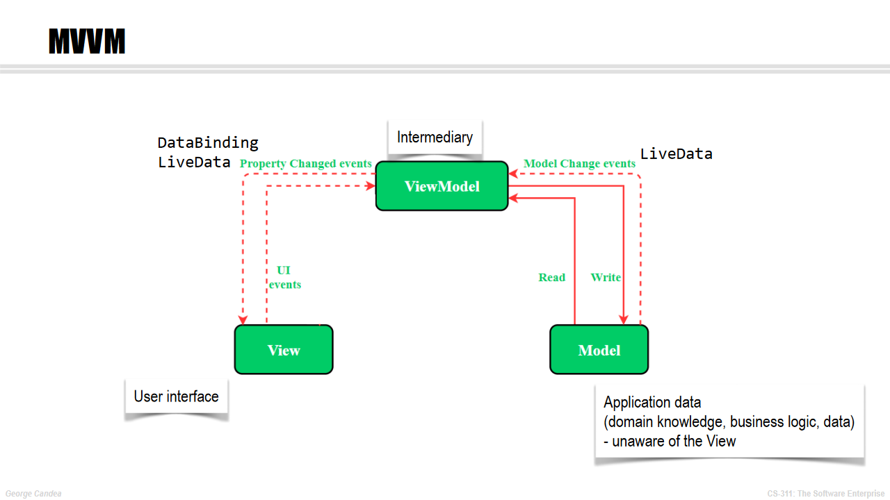
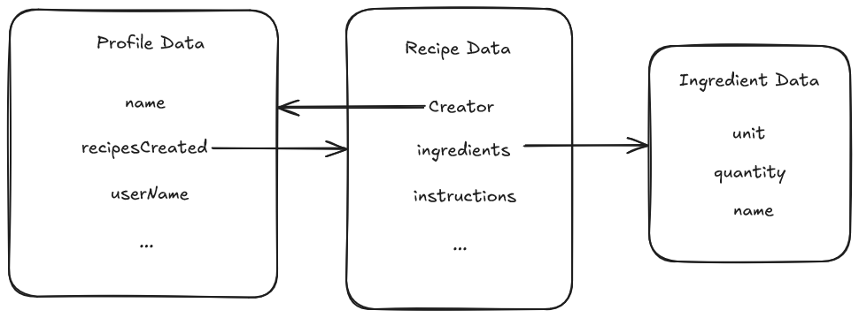
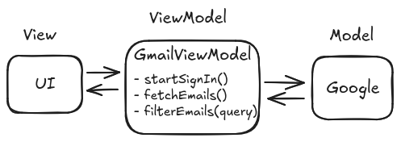
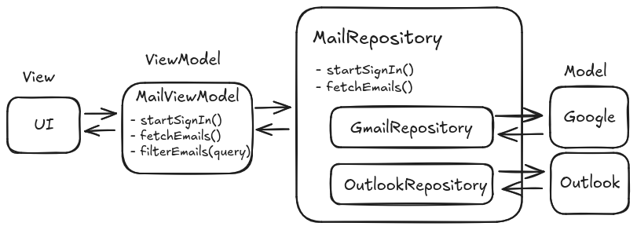

# Implementing the MVVM

In this handout, we will explain how to implement the MVVM pattern and understand the flow of data between different layers. In the upcoming steps of the bootcamp, you will implement various features using the MVVM pattern.

## App structure overview

The app is typically structured into three main layers:

- **UI Layer:** This layer is responsible for displaying the application data on the screen and handling user interactions. It consists of composable functions that define the user interface and respond to changes in the data provided by the ViewModel.

- **ViewModel Layer**: This layer acts as a bridge between the UI and the data layer. It manages UI-related data in a lifecycle-aware manner and exposes this data to the UI using observable data holders like `StateFlow`.

- **Data Layer**: This layer is responsible for handling the business logic of your app and managing application data. It consists of models (data classes) and repositories that provide a clean API for data access.



### Data Layer

#### Data Class

To get started with implementing an app, we need to define those objects. Read the users stories, what is the app about ?
It is about task tracking, to-do!

- what attribute should a ToDo have ?
- What does it depend on ?
- What relations does ToDo have ?
  - Who created it, where, what does it reference ?

>[!TIP]  
>The model does not have to be complete from the start, focus on one user story, once it's implement, adapt your model to fit your next user story!

A schema is good idea to get started !
Here is an simplified example, inspire yourself from it  



To define an object in kotlin, we can create a data class :

```kotlin
data class Profile(
   val name: String = "NAME_DEFAULT",
   val userName: String,
   var recipesCreated: List<Recipe>, 
   ...
)
```

#### Repository

The Repository acts as an **abstraction layer** between the ViewModel and data sources. This ensures that the ViewModel doesn't need to know where the data comes from. The repository consolidates data access logic and provides clean APIs to the ViewModel.

>[!NOTE]  
> How to implement an abstraction layer?  
> Using an interface, remember the [SplitIntoComponents](#splitting-an-app-into-components-using-interfaces) theory !

A repository interface defines the methods needed to interact with data sources. For our Profile example, a repository interface could look like this:

```kotlin
interface ProfileRepository {
    fun getProfile(
        userId: String,
        onSuccess: (Profile) -> Unit,
        onFailure: (Exception) -> Unit
    )

    fun updateProfile(
        profile: Profile,
        onSuccess: () -> Unit,
        onFailure: (Exception) -> Unit
    )

    fun deleteProfile(
        userId: String,
        onSuccess: () -> Unit,
        onFailure: (Exception) -> Unit
    )
}
```

>[!NOTE]  
> To manage asynchronous behavior, we use callback functions such as `onSuccess` and `onFailure`.  
> This allow the callee to define the behavior to adopt, such as display an error message or updating the UI.
---

### UI Layer : View

The View in Jetpack Compose is defined using composable functions, which describe how the UI should look based on the current state provided by the ViewModel. The View should:

- Observe changes from the ViewModel and update the UI accordingly.
- Respond to user interactions and delegate actions back to the ViewModel to update the state or trigger business logic.

A basic profile screen without styling could look like this

```kotlin
@Composable
fun ProfileScreen(viewModel: ProfileViewModel) {
    val profileState = viewModel.profile.collectAsState()

    Column() {
        Text(text = "Profile")
      
        profileState.value?.let { profile ->
            Text(text = "Name: ${profile.name}")
            Text(text = "Username: ${profile.userName}")
      
            Button(onClick = { 
                // Handle edit profile action
                viewModel.updateProfile(profile.copy(name = "New Name"))
            }) {
                // This is the text inside the button!
                Text(text = "Edit Profile")
            }

            Button(onClick = { viewModel.deleteProfile(profile.userName) }) {
                Text(text = "Delete Profile")
            }
        }
    }
}

```

>[!NOTE]  
> What does `profileState.value?.let { ... }` mean ?  
> `profileState.value` refer to the current value of the state  
> `?.` is the *safe call operator*, if the value is not null, the code will execute the `let { ... }` part.
> [Here](https://kotlinlang.org/docs/null-safety.html) you can find all the null safety of kotlin!

### ViewModel

The ViewModel is responsible for:

- Managing UI-related data in a lifecycle-conscious way.
- Exposing state to the UI using `StateFlow` or similar observable data holders.
Handling logic that transforms data for display in the View.
- Interacting with the Model to fetch, update, or delete data.

```kotlin

class ProfileViewModel(private val repository: ProfileRepository) : ViewModel() {

   private val profile_ = MutableStateFlow<Profile?>(null)
   val profile: StateFlow<Profile?> get() = profile_

   fun loadProfile(userId: String) {
      repository.getProfile(userId,
         onSuccess = { profile ->
            profile_.value = profile
         },
         onFailure = { exception ->
            // Handle error (e.g., show a toast or log the error)
            profile_.value = null
         }
      )
   }

   fun updateProfile(profile: Profile) {
      repository.updateProfile(profile,
         onSuccess = {
            loadProfile(profile.userName) 
         },
         onFailure = { exception ->
            // Handle error
         }
      )
   }

   fun deleteProfile(userId: String) {
      repository.deleteProfile(userId,
         onSuccess = {
            profile_.value = null // Clear profile state after deletion
         },
         onFailure = { exception ->
            // Handle error
         }
      )
   }
}
```

>[!NOTE]  
> What does `viewModelScope.launch { ... }` mean ?
> [A coroutines](https://developer.android.com/kotlin/coroutines) allows the execution of asynchronous code!  
> [`viewModelScope`](https://developer.android.com/topic/libraries/architecture/viewmodel#lifecycle) is a property that allow to tied the coroutine to the lifecycle of the ViewModel. Hence, this coroutine will die once the ViewModel is cleared.
> `.launch { ... }` is the coroutine builder  

---

## Hands On Approach

Generally, we recommend this approach when implementing a user story :

1. Read the user story.
1. Think about what you need to add to:
   - the Data Class
   - The ViewModel
   - The interfaces to external APIs (e.g. a repository using Firestore)
   - The UI (also have a look at the Figma)
1. Create the required classes/functions - without implementing them !
1. For the bootcamp, add the sigcheck for this user story, and check that it matches your code.
1. Implement the classes/functions.
1. Write tests.

> [Return to the Table of Contents](../../README.md#table-of-contents)

# Splitting an app into components using interfaces

When building an app (or any piece of software), it can be very useful to split its different parts into fully separate components, interacting with each other with interfaces.

When done correctly, this modularity allows to swap parts of the software, to add new features. It is also very useful for testing purposes, since it becomes easy to test components one by one to verify their behavior, or how they interact with each other.

## Basic example

Let's create an email client for GMail addresses using the MVVM:



Let's take a look at what the GmailViewModel looks like :

```kotlin
data class Email(val sender: String, val subject: String, val content: String)

class GmailViewModel : ViewModel() {
    
    var account: GoogleAccount? = null
        private set

    fun startSignIn() {
        account = Google.openLoginDialog()
    }

    fun fetchEmails(): List<Email> {
        val response = http.get("https://google.com/mail/mails?id=${account?.id}")

        if (!response.ok) {
            return emptyList()
        }

        val body = Json.decodeFromString<List<Map<String, String>>>(response.body?.string() ?: "")

        return body.map { element ->
            Email(
                sender = element["sender"] ?: "",
                subject = element["subject"] ?: "",
                content = element["content"] ?: ""
            )
        }
    }

    fun filterEmails(query: String): List<Email> {
        return fetchEmails().filter { it.content.contains(query) }
    }
}
```

## Using interfaces to improve modularity

Now let's say we want to support Outlook emails. There are several issues, such as:

- there is no `Outlook.openLoginDialog()` function, instead we need to provide `email` and `password` to an HTTP endpoint.
- the content of the email is in the key `body`, instead of `content`
- the account is not a `GoogleAccount`
- the endpoint to get the mails is not the same

We could work around those using an enum and switch cases, but there is actually a much better solution: using a generic `MailViewModel`, which interacts with an interface describing the mail server:

We create a `MailRepository` interface, containing the interactions we want for the mail server, then the implementations (`GoogleMailRepository` and `OutlookMailRepository`). Now, we can easily choose the repository used by the viewmodel to handle both cases.



If we now have a look at the codebase:

```kotlin
interface MailRepository {
    fun startSignIn()
    fun fetchEmails(): List<Email>
}

class MailViewModel(private val repository: MailRepository) : ViewModel(){

    fun startSignIn() {
        repository.startSignIn()
    }

    fun fetchEmails(): List<Email> {
        return repository.fetchEmails()
    }

    fun filterEmails(query: String): List<Email> {
        return fetchEmails().filter { it.content.contains(query) }
    }
}

class GoogleMailRepository : MailRepository {
    private var account: GoogleAccount? = null

    override fun startSignIn() {
        account = Google.openLoginDialog()
    }

    override fun fetchEmails(): List<Email> {
        val response = http.get("https://google.com/mail/mails?id=${account?.id}")

        if (!response.ok) {
            return emptyList()
        }

        val body = Json.decodeFromString<List<Map<String, String>>>(response.body?.string() ?: "")

        return body.map { element ->
            Email(
                sender = element["sender"] ?: "",
                subject = element["subject"] ?: "",
                content = element["content"] ?: ""
            )
        }
    }
}

class OutlookMailRepository : MailRepository {
    private var account: OutlookAccount? = null

    override fun startSignIn() {
        val credentials = Dialog.askFields(listOf("email", "password"))
        val response = http.get("https://outlook.com/login?email=${credentials["email"]}&password=${credentials["password"]}")

        if (!response.ok) {
            return
        }

        account = Json.decodeFromString(response.body?.string() ?: "")
    }

    override fun fetchEmails(): List<Email> {
        val response = http.get("https://outlook.com/mails?user_id=${account?.userId}")

        if (!response.ok) {
            return emptyList()
        }

        val body = Json.decodeFromString<List<Map<String, String>>>(response.body?.string() ?: "")

        return body.map { element ->
            Email(
                sender = element["sender"] ?: "",
                subject = element["subject"] ?: "",
                content = element["body"] ?: ""
            )
        }
    }
}
```

This approach also makes testing much easier. As you'll see in the next lecture, it allows to tests different parts of the application separately.

# Commit messages

Commit messages are essential to work efficiently with other persons. They provide context for why a change was made, facilitate code review, and improve the overall maintainability of a project. Well-written commit messages make it easier for teams to understand the history of a project and to pinpoint issues when bugs arise.

## Best Practices

1. Write Clear and Descriptive Messages\
   A commit message should describe the **what** and **why** of the change. A good message gives an overview of the work and its purpose, making it easier for others to understand the change.
   Avoid generic messages like "fix" or "update" as they do not provide enough context.

2. Use the Imperative Mood\
   The convention is to write the message in the imperative mood, as if you are giving an order or command. For example, use "Fix bug in user login" instead of "Fixed bug in user login." This follows the style used by Git itself when creating commits (e.g., "Merge branch...").

3. Keep the Message Short and Focused\
   Limit the subject line (the first line of the commit message) to 50 characters or less.
   If more detail is needed, include a blank line after the subject line, followed by a more detailed explanation in the body. This body can include reasoning, background information, or links to related resources.

4. Capitalize the First Letter of the Subject\
   This improves readability and follows general writing conventions.

5. Use the Body to Explain What and Why (optional)\
   If the subject line is not enough to fully convey the change, add more details in the body of the commit. The body should be wrapped at 72 characters per line to ensure readability.

6. Reference Issues or Tickets (optional)\
   If your commit relates to a specific issue, reference it in the commit message by including a ticket number or issue ID. This helps track the commit back to the specific requirement or bug report it addresses.

## Examples

### Good commit messages

```markdown
Add user authentication feature

Add a new authentication system using JWT to handle user login and session management.
This update includes token generation, middleware for protecting routes, and unit tests.

Related to #42
```

```markdown
Fix typo in the README file
```

```markdown
refactor: extract API request logic into a service class

Moved repetitive API request logic from controllers to a dedicated service class.
This improves maintainability and adheres to the DRY principle.
```

### Bad commit messages

```markdown
fix
```

```markdown
Changes to the login feature
```

```markdown
Fixed bug in code
```

## Advanced: Understanding Conventional Commits

> [!NOTE]
> This section is not required for the bootcamp nor for the project, but is one of the optional exercises.

The [Conventional Commits](https://www.conventionalcommits.org/en/v1.0.0/) specification is a standardized format for commit messages. This convention adds a type and optional scope to your commit message, making it easier to understand the purpose of the commit at a glance.

Over the years, this practice has gained popularity, more and more developers and enterprise are using this convention. It increases the clarity of each commit, and the standardized format for the message allows scripts to classify commits, for example to automatically generate a changelog or trigger specific job in the CI/CD (release a patch on a `fix`, etc.).

Structure of a Conventional Commit:

```markdown
<type>[optional scope]: <description>

[optional body]

[optional footer(s)]
```

- **Type**: Describes the category of change (e.g., `feat`, `fix`, `docs`, `style`, `refactor`, `test`, `chore`).
- **Scope** (Optional): A noun describing a section of the codebase affected (e.g., `auth`, `api`, `ui`).
- **Description**: A brief summary of the changes made.
- **Body** (Optional): Explains the motivation behind the change and what was done.
- **Footer** (Optional): Contains any references to issues or breaking changes.

Examples of Conventional Commits

```markdown
feat(api): add user registration endpoint

Added a new endpoint for user registration, including validation and database persistence.
```

```markdown
fix(auth): resolve password reset issue

Fixed an issue where users were unable to reset their passwords due to incorrect token validation.
Closes #56
```

> [!WARNING]
> When writing commit messages using this convention, the description of the change is **not** capitalized.

## Further reading

- [Chris Beams' guide on writing good commit messages](https://chris.beams.io/posts/git-commit/)
- [Conventional Commits specification](https://www.conventionalcommits.org/en/v1.0.0/)

> [Return to the Table of contents](./../README.md)
>
# User stories

A user story must follow the structure:

```
As a [type of user], I want [an action] so that [a benefit/value].
```

- Identify the specific user or role who will benefit from the feature. This can be a real user, like a customer or admin, or an abstract user, like a bot.
- Describe the action or task the user wants to perform. This should be clear and specific.
- Explain why the user wants to perform this action. What value or benefit will it provide them? This part ensures that the user story aligns with business goals.
- (Optional) Define conditions that must be met for the story to be considered complete. This can include specific functionality, performance metrics, or user experience details.

## Best practices

- Keep It User-Centric. Focus on the user's needs rather than technical tasks. The goal is to ensure the development team understands the value from the user's perspective.
- Be Concise but Clear. The story should be brief but informative enough to guide development. Avoid ambiguous language.
- Avoid Technical Jargon. Use language that the user would understand. This ensures that all team members can grasp the story's intent.
- Include Acceptance Criteria. Clearly outline the conditions that will make the story complete. This helps avoid misunderstandings and ensures that the development meets expectations.
- Make It Negotiable. User stories are not contracts but conversation starters. They should be flexible enough to adapt during discussions between team members.

## Examples

### Good user stories

```markdown
As a returning customer, I want to view my previous orders so that I can quickly reorder items I liked.
```

---

```markdown
As an admin, I want to generate a monthly sales report so that I can track our store's performance.

Acceptance Criteria:

- The report includes total sales, number of transactions, and top-selling products.
- The admin can select a date range for the report.
- The report is exportable as a CSV or PDF file.
```

### Bad user stories

```markdown
As a user, I want to log in.
```

This story lacks context about why the user wants to log in and what value this provides. A better story might specify the purpose of logging in, such as accessing personalized content or account settings.

---

```markdown
As a developer, I want to refactor the authentication module.
```

This story is developer-centric rather than user-centric. User stories should focus on the user's needs. A better story might be: "As a user, I want to log in securely so that my personal information is protected," with the refactoring work addressed as part of the implementation plan.

---

```markdown
As a customer, I want better search functionality.
```

This story is too vague. It doesn't specify what "better" means or how the user experience should improve. A more precise story could be: "As a customer, I want to filter search results by price, rating, and category so that I can find products that meet my specific needs."

## Recap of the INVEST Criteria for User Stories

To ensure your user stories are of high quality, you can follow the **INVEST** acronym:

- Independent: Each story should be self-contained and not depend on other stories.
- Negotiable: Stories should be flexible to allow for collaboration and refinement.
- Valuable: The story should deliver value to the user.
- Estimable: The team should be able to estimate the effort required to complete the story.
- Small: Stories should be small enough to be completed within a single iteration.
- Testable: The story should be clear enough to define tests that confirm the feature works as intended.

## Further reading

- [Mountain Goat Software's Guide to User Stories](https://www.mountaingoatsoftware.com/agile/user-stories)

> [Return to the Table of Contents](../../README.md#table-of-contents)
