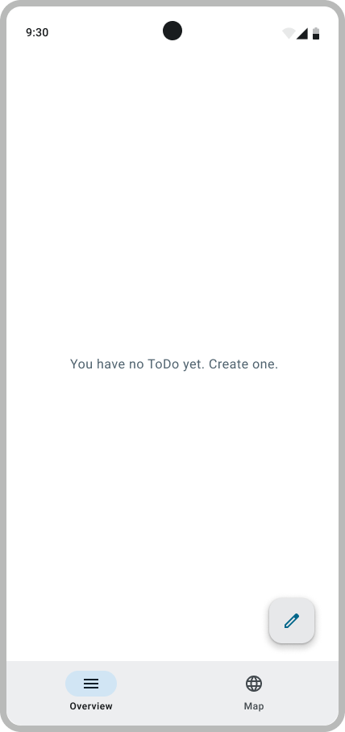

# 2. Create A ToDo

## Introduction

Jetpack Compose is a modern paradigm for Android app development that relies on a single activity (i.e. a single entry-point for the application) with a dynamic UI rendered based on a [navigation framework](https://developer.android.com/guide/navigation?hl=fr) and nested components called composable functions. This is a common paradigm and similar to other front-end frameworks such as React for web and app development.

> [!WARNING]  
> Be aware that because this paradigm is pretty recent in the Android world, you may find information and tutorials referencing multiple activities (i.e., multiple, isolated entry-points) and making use of fragments (i.e. reusable portions of the UI within an activity). Fragments are irrelevant in Jetpack Compose, and you're unlikely to make use of multiple activities in this bootcamp.
>
> When searching for relevant information, it might help you to reference [Modern Android Development (MAD)](https://developer.android.com/modern-android-development?hl=fr) guidelines.

<p align="center"> </p>

## Implement the navigation

In order to display something else after you sign-up, you will need a proper navigation system.

First, let's create some screen/UI :  
Create a folder `overview` in `app/ui`. Then create `Overview.kt`and `AddToDo.kt`.  
Create a folder `map` in `app/ui`. And then create `Map.kt`.

> [!WARNING]  
> Look at the [Navigation tutorial](../../Tutorials/Navigation.md) to see how to implement it.

You will need to define the Scaffold in every screen, and you can choose to display the `BottomNavigationMenu` if it's relevant to the screen.
In `AddToDo.kt`, add a Scaffold with only a [TopAppBar](https://developer.android.com/develop/ui/compose/components/app-bars) to be able to go back to the previous visited screen.

The creation of a to-do occurs on the overview screen, it should only be composed of a scaffold for the moment.
You will need to add a [Floating Action Button](https://developer.android.com/develop/ui/compose/components/fab) to navigate to the Add ToDo screen.

<p align="center"></p>

Before moving on, make sure that your navigation works and you can navigate between the map, overview and Add a Todo Screens. Set some Text in the content of the each Scaffold to be able to see which composable is shown.

> [!TIP]  
> Your composable will need to take as parameters `navigationActions: NavigationActions
`

## Model for the ToDo

Android is based on the [Model View ViewModel (MVVM) architecture](../../Theory.md#implementing-the-mvvm). This architecture is used to separate the logic of the app from the UI. It is composed of three elements:

- The Model: It is the data of the app. It defines the type of data that will be used by the app.
- The Repository : This is where the data come from.
- The View: It is the UI of the app. It is what the user will see.
- The ViewModel: It is the logic of the app. It is the logic that will be executed when the user interacts with the app.

You will need to create the following folder `model/todo` and a file `ToDo.kt`.
Add all the following classes to this file :

- `ToDo`: This `data class` represents a to-do of the app, and contains the following properties:

  - `uid`: the unique `String` id of the to-do
  - `name`: the name of the to-do
  - `description`: the description of the to-do
  - `assigneeName`: the name of the person assigned to the to-do
  - `dueDate`: the due date of the to-do, use `com.google.firebase.Timestamp` for the format.
  - `location`: the location of the to-do
  - `status`: the status of the to-do

- `ToDoStatus`: This `enum class` represents the status of a to-do, and contains the following members:

  - `CREATED`: the to-do is not done yet
  - `STARTED`: the to-do is in progress
  - `ENDED`: the to-do is done
  - `ARCHIVED`: the to-do is archived

You will need to create the following folder `model/map` and a file `Location.kt`.
Add all the following classes to this file :

- `Location`: This `data class` represents a location, and contains the following properties:
  - `latitude`: the latitude of the location
  - `longitude`: the longitude of the location
  - `name`: the name of the location

> [!NOTE]  
> Even if the location is unrelated to the current user story, to avoid future issue, we directly implement it to the model.

### Creating the Repository Interface

The app will need to do the following data with the database:

- obtain new UIDs
- obtain stored to-dos: one at a time and all of them at the same time
- update stored to-dos
- add new to-dos into the database
- remove to-dos from the database

This translate to the following interface :

```kotlin
package com.github.se.bootcamp.model.todo

interface ToDosRepository {
  fun getNewUid(): String
  fun getToDos(onSuccess: (List<ToDo>) -> Unit, onFailure: (Exception) -> Unit)
  ...
}
```

In `model/todo` create a file `ToDosRepository` and paste the above code

### Implementing the Firestore Repository

Now, it’s time to implement the interface in a class named `ToDosRepositoryFirestore`. This class will be the bridge between the database, [Firestore](https://firebase.google.com/docs/firestore), and the rest of our application. Firestore manipulates objects as `Map<String,Any>`, so converting from and to Maps will be necessary.

To do so, in `model/todo` create a file `ToDosRepositoryFirestore`.

```kotlin
class ToDosRepositoryFirestore(private val db: FirebaseFirestore) : ToDosRepository {

  private val collectionPath = "todos"

  ...
}
```

All methods of the class `ToDosRepositoryFirestore` should Log the error when something fails using `Log.e()`

Tips:

- Use `document.get("fieldName")` to retrieve data fields from a Firestore document. You can also use the getter method for the data type, such as `getString()` directly.
- Create a helper method to convert a `DocumentSnapshot` from Firestore into your `ToDo` data class. For the inverse, you may not require it.
- Use `addOnCompleteListener` with `result.isSuccessful` and `result.exception` to call the call back `onSuccess` and `onFailure`
- To detect failures of the FirestoreDatabase, use a try catch, you can also look into the method `addOnFailureListener( listenerResponse : (Exception) -> Unit )`.
- If you are still not sure how to use the `Task` type, explore the code of Firestore, you will find examples there.
  Links you may find useful:
  - <https://firebase.google.com/docs/firestore>
  - <https://firebase.google.com/docs/firestore/query-data/get-data>
  - <https://firebase.google.com/docs/firestore/manage-data/add-data>

### Creating the ViewModel

For now, our viewModel will only serve to call the method of our repository : get new uid and add to do.

```kotlin
package com.github.se.bootcamp.model

class ListToDosViewModel(private val repositoryFirestore: ToDosRepository) : ViewModel() {
}
```

> [!NOTE]  
> Upon successfully creating a ToDo, you should display a [Toast](https://developer.android.com/guide/topics/ui/notifiers/toasts) to inform the user.

## Create a Todo Screen

<p align="center"></p>

Remember the `Greeting`composable ? It should be quite similar.

However, inputing a Date can be quite tricky. For simplicity, we will use strings in the format `DD/MM/YYYY`. When the user wants to save the ToDo, you can convert the string to a `Timestamp` by using the [`Calendar`](https://docs.oracle.com/javase/7/docs/api/java/util/Calendar.html) interface and its implementation `GregorianCalendar`.

> [!IMPORTANT]
> For compatibility with the tests, always set the hours, minutes and seconds to 0.

> [!NOTE]  
> For the moment, hard code a val Location for the creation of a ToDo and a place holder `OutlinedTextField`. In B3 you will implement the [`Nominatim API`](https://nominatim.org/).

```kotlin
@Composable
fun AddToDoScreen(listToDosViewModel: ListToDosViewModel, navigationActions: NavigationActions) {...}
```

## Error handling

Here, several things can fail: the date may be incorrectly formatted, the call to the repository may result in an error, etc.

There are several ways to handle those cases:

- Logging the error message (using the `Log` class)
- Showing a [`Toast`](https://developer.android.com/guide/topics/ui/notifiers/toasts) to the user
- Displaying an error message in the Composable using a state

The ideal is to display the error message, either dynamically with a state or with a `Toast`, but in the context of this bootcamp, you may use only a log, for simplicity.

## Run It

To test it, navigate to the Add ToDo screen, then create a ToDo. You should see a toast of confirmation. Next, open Firebase, go under the section Firestore and you should see the following :

<p align="center"></p>

## Validate your work

[Signature check](../sigcheck/AddToDosSignatureChecks.kt) (see the [doc](../sigcheck/README.md))

[UI Test Tag](https://www.figma.com/design/IDm3NGS988Myo01P0Wa0Cr/TO-DO-APP-Mockup-FALL?node-id=435-3350&node-type=CANVAS&t=sv1SW1HVH5J4WQlx-0)

Test files:

- [`AddToDoScreenTest.kt`](../tests/AddToDoScreenTest.kt) -> `app/src/androidTest/java/com/github/se/bootcamp/ui/AddToDoScreenTest.kt`
- [`ListToDosViewModelTest.kt`](../tests/ListToDosViewModelTest.kt) -> `app/src/test/java/com/github/se/bootcamp/model/ListToDosViewModelTest.kt`
- [`NavigationActionsTest.kt`](../tests/NavigationActionsTest.kt) -> `app/src/test/java/com/github/se/bootcamp/ui/navigation/NavigationActionsTest.kt`
- [`MainDispatcherRule.kt`](../tests/MainDispatcherRule.kt) -> `app/src/test/java/com/github/se/bootcamp/MainDispatcherRule.kt`

---

> [!NOTE]  
> Please click [here](UserStory.md#2-create-a-to-do) to come back to the corresponding user-story.
> Remember to check the SigCheck description [here](../sigcheck/README.md) while implementing the Activity.
