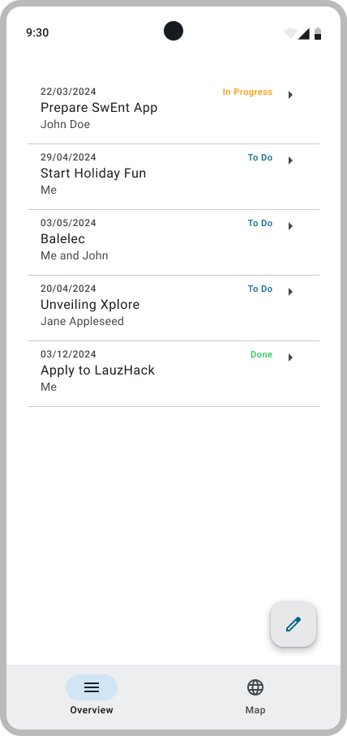

# 3. List Of Todos

 

## Update the ViewModel

Our viewModel need to serve the data, our list of todos, to UI. Have a look at [`MutableStateFlow`](https://developer.android.com/kotlin/flow/stateflow-and-sharedflow). It allows emitting the current and new state updates to its collectors, in our case the UI.

> [!TIP]  
> To fetch the Todos initially, use `init { }`. Init will run at the initialization of the viewmodel. Make sure the Repository is ready to access the database too.

> Follow the example of the [Reply Sample App](https://github.com/android/compose-samples/tree/main/Reply/app/src/main/java/com/example/reply/ui) for the implementation of a ViewModel.

## Update `Overview` composable

Every time the `MutableStateFlow` emit, the UI need update itself with the new data. Have a look at [`collectAsState`](<https://developer.android.com/reference/kotlin/androidx/compose/runtime/package-summary#(kotlinx.coroutines.flow.StateFlow).collectAsState(kotlin.coroutines.CoroutineContext)>)

The body of the scaffold will be composed of a `LazyColumn` composable. This composable is optimized to display a list of items of unknown size. You can find more information on how to use it in [the official documentation](https://developer.android.com/develop/ui/compose/lists#lazy).

---

## Validate your work

[Signature check](../sigcheck/ViewToDosSignatureChecks.kt) (see the [doc](../sigcheck/README.md))

[UI Test Tag](https://www.figma.com/design/IDm3NGS988Myo01P0Wa0Cr/TO-DO-APP-Mockup-FALL?node-id=435-3477&node-type=SECTION&t=G6De7qCsUE3haq35-0)

Test files:

- [`OverviewScreenTest.kt`](../tests/OverviewScreenTest.kt) -> `app/src/androidTest/java/com/github/se/bootcamp/ui/OverviewScreenTest.kt`

---

> [!NOTE]  
> Please click [here](UserStory.md#3-list-of-to-dos) to come back to the corresponding user-story.
> Remember to check the SigCheck description [here](../sigcheck/README.md) while writing tests.
