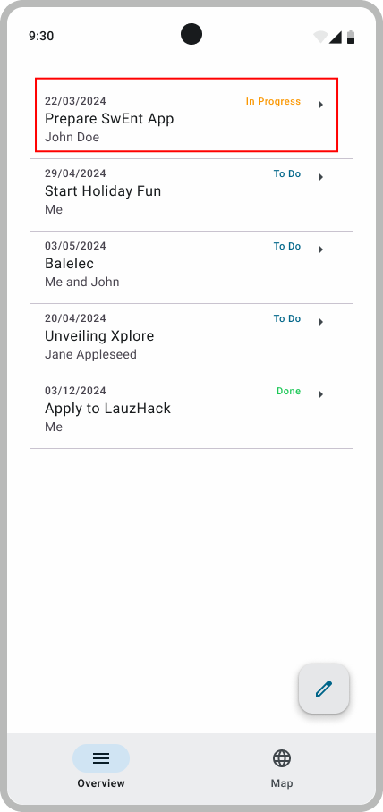
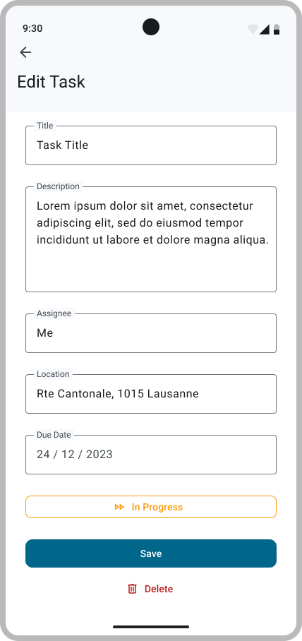

# 4. Edit a To-Do

 

As illustrated above, this step involves implementing the functionality for editing and viewing a to-do. As shown in the overview screen, your list of to-do items is displayed (in the provided example, there is only one to-do). Upon clicking on a to-do, you are directed to a second screen where you can both view and edit it.

On this detailed screen, similar to the creation screen, you can find additional elements like a delete button and a button to modify the to-do's status. It mirrors the creation interface but includes these extra features.

After making changes to the to-do, including altering its status, it is expected that the user clicks on the save button to propagate the modifications to Firestore. Subsequently, the screen transitions back to the overview, reflecting the updated information.

For the status update, each click should move the status to another status. I.e `CREATED` -> `STARTED` ... `ARCHIVED` -> `CREATED`. The displayed text should be lowercase, with spaces instead of underscores, and the first letter capitalized.

> [!NOTE]  
> For the moment, hard code a val Location for the edition of a ToDo and a place holder `OutlinedTextField`. In B3 you will implement [`Nominatim API`](https://nominatim.org/).

---

## Validate your work

[Signature check](../sigcheck/EditToDosSignatureChecks.kt) (see the [doc](../sigcheck/README.md))

[UI Test Tag](https://www.figma.com/design/IDm3NGS988Myo01P0Wa0Cr/TO-DO-APP-Mockup-FALL?node-id=435-3368&node-type=SECTION&t=G6De7qCsUE3haq35-0)
Test files:

- [`EditToDoScreenTest.kt`](../tests/EditToDoScreenTest.kt) -> `app/src/androidTest/java/com/github/se/bootcamp/ui/EditToDoScreenTest.kt`

---

> [!NOTE]  
> Please click [here](UserStory.md#4-edit-a-to-do) to come back to the corresponding user-story.
> Remember to check the SigCheck description [here](../sigcheck/README.md) while writing tests.
