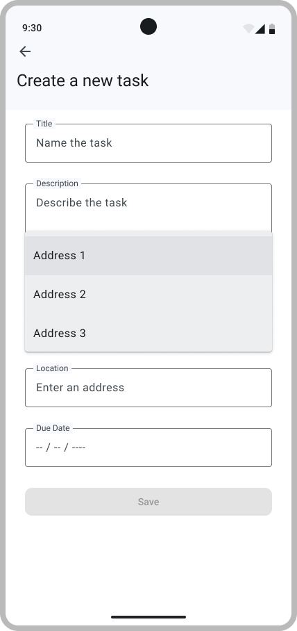
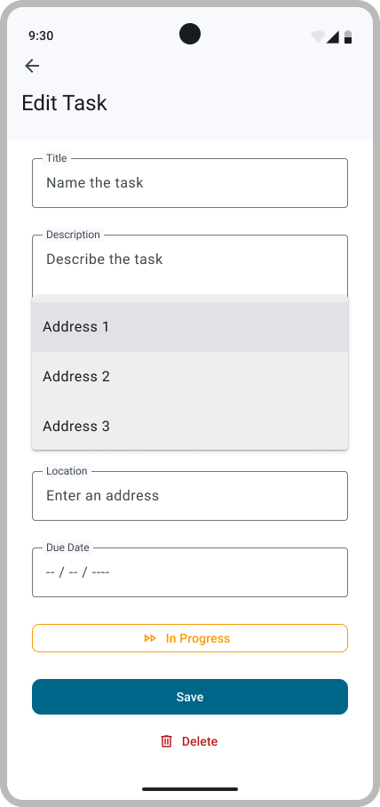

# 5. Location-based To-Dos

## Reverse Geo-Coding - Nominatim

When a user is creating a new to-do, entering GPS coordinates for the location may not be very user-friendly. This is where Reverse Geocoding comes in handy. It allows the user to input text, which will then be converted into GPS coordinates. This is similar to how Google Maps works—where you enter text and it provides a precise location on the map. Since the reverse geocoding feature in the Google Maps API is not free, so we will be using [Nominatim](https://nominatim.org/). To query the API, we will use OkHTTP.

### OkHTTP

[OkHTTP](https://square.github.io/okhttp/) is a powerful and efficient HTTP client for Android that simplifies the process of making network requests in your app. With a clean and easy-to-use API, OkHttp handles tasks like connection pooling, request/response compression, and even supports asynchronous requests. It's built on top of the robust Okio library, making it efficient for reading and writing data. OkHttp is widely used in Android development to perform network operations, fetching data from servers, and interacting with APIs. Its simplicity and reliability make it a popular choice for developers when dealing with network communication in Android applications.

> [!WARNING]
> To test a Web Request API, we advise you to mock it in order to have idempotent tests (tests that can be run multiple times without changing the system's state after the first run).

## Map Tab

<p align="center"></p>

The Map tab will display a map with the location of the to-dos. To do so, you will need to use the `MapView` composable. This composable is used to display a map. You can find more information on how to use it in the [Google Map Compose Sample](https://github.com/googlemaps/android-maps-compose).

## Model for the API Nominatim

In `model/map` add the following files. To guide in the right direction, we directly provide you the class signature.

- a file `LocationRepository.kt`.

    ```kotlin
    interface LocationRepository {
    fun search(query: String, onSuccess: (List<Location>) -> Unit, onFailure: (Exception) -> Unit)
    }
    ```

- a file `LocationViewModel`.

    ```kotlin
    class LocationViewModel(val repository: LocationRepository) {...}
    ```

- a file `NominatimLocationRepository` : Copy and paste the below code.

    ```kotlin
    class NominatimLocationRepository(val client: OkHttpClient) : LocationRepository {...}
    ```

> [!TIP]
> To get started, try to find the correct API call to on  [Nominatim Endpoint with a query parameters](https://nominatim.org/release-docs/develop/api/Search/) using your browser.
> Then implement the `NominatimLocationRepository` to automatically make that request and parse the resulting json.  
> The result should have multiple suggestions that we will display in a dropdown menu !

## Update AddToDo and EditToDo Screen

After having implemented logic, we can now finally input address in your Location placeholder.

For the dropdown menu, use a [`DropDownMenu`](https://composables.com/material3/dropdownmenu) with some `DropdownMenuItem`

<p align="center"> </p>

---

## Validate your work

[Signature check](../sigcheck/MapSignatureChecks.kt) (see the [doc](../sigcheck/README.md))

[UI Test Tag](https://www.figma.com/design/IDm3NGS988Myo01P0Wa0Cr/TO-DO-APP-Mockup-FALL?node-id=435-3350&node-type=CANVAS&t=G6De7qCsUE3haq35-0)

---
>
> [!NOTE]  
> Please click [here](UserStory.md#5-Location-based-to-dos) to come back to the corresponding user-story.
> Remember to check the SigCheck description [here](../README.md) while writing tests.
